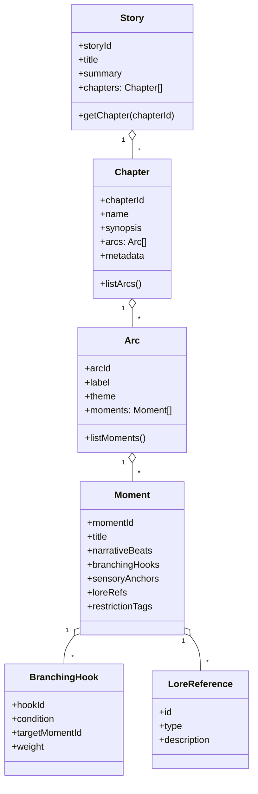
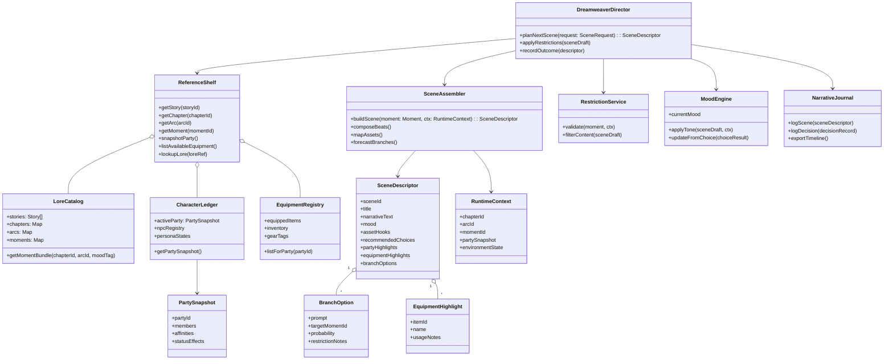
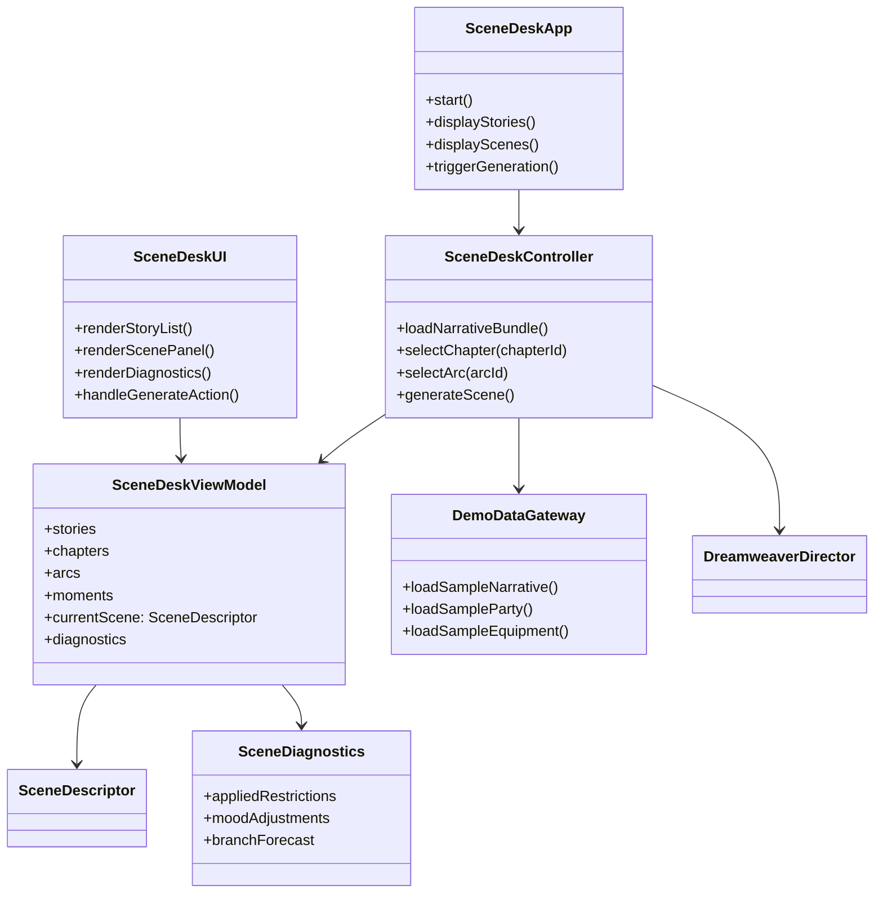

# Dreamweaver & Narrative Application Requirements

This document consolidates the non-negotiable requirements for the cross-language Dreamweaver and Narrative applications. It aligns the project plans with the agreed architecture (Story → Chapter → Arc → Moment → Scene), enforces SOLID and DRY practices, and defines the shared demo application the team must deliver for reviewers to experience real functionality.

## 1. Architecture Alignment
- **Narrative Hierarchy**: Narrative data remains immutable and author-focused, structured strictly as `Story → Chapter → Arc → Moment`. Each `Moment` is the lowest-level authored unit and must not contain runtime state.
- **Scene Construction**: Runtime `SceneDescriptor` objects are assembled from `Moment` data combined with active party, equipment, and chapter context. Scenes are the only objects surfaced to the game layer or demo UI.
- **Reference Shelf**: Dreamweaver orchestration relies on a `ReferenceShelf` that exposes quick lookups for authored lore (stories/chapters/arcs/moments), active characters, and available equipment. This shelf mirrors the “DM gathers books” metaphor and must be accessible with low-latency cache semantics.
- **Responsibility Split**: Narrative authoring modules never depend on Dreamweaver runtime classes. Dreamweaver services consume narrative data via interfaces and return scene descriptors; no bidirectional coupling is permitted.
- **Dreamweaver Workflow**: `DreamweaverDirector` selects the next `Moment`, consults restrictions/emotional tone, delegates assembly to `SceneAssembler`, logs results in `NarrativeJournal`, and emits a `SceneDescriptor` to the demo front end and game adapters.
- **Tests & Demonstrations**: All validations (automated or manual) must exercise the full flow: fetch authored data → assemble scene → present via demo UI. Lower-level utility tests that do not touch the application pathway are out of scope.

### 1.1 Narrative Data Model

### 1.2 Dreamweaver Orchestration Model

### 1.3 Dreamweaver Scene Desk Demo Flow

## 2. Engineering Principles (SOLID & DRY)
- **Single Responsibility**: Each class provides one cohesive capability (e.g., `SceneAssembler` only merges data, `RestrictionService` only enforces content guardrails). Avoid “God objects.”
- **Open/Closed**: Scene assembly rules extend via strategy interfaces (e.g., new mood strategies) without modifying core orchestrators.
- **Liskov Substitution**: Any derived narrative component (e.g., specialised `Moment` variants) must honour base contracts so the Dreamweaver can substitute them seamlessly.
- **Interface Segregation**: Provide lean interfaces (`IMomentRepository`, `IPartySnapshotProvider`) rather than monolithic service contracts.
- **Dependency Inversion**: High-level policies (Dreamweaver logic) depend on abstractions, with concrete adapters wired via dependency injection appropriate to each language stack.
- **DRY Enforcement**: Shared behaviour (scene formatting, validation schemas, sample data builders) resides in reusable modules. Duplicate logic between CLI, API, and UI layers is prohibited—use shared presenters/formatters instead.

## 3. Demo Application Requirement
Every language implementation must ship the **Dreamweaver Scene Desk**, a lightweight front end that reviewers launch to validate functionality:

- **Experience**:
  1. Load canonical sample data (single story with multiple chapters/arcs/moments).
  2. Display a list of chapters and arcs; selecting one surfaces available moments.
  3. Show the assembled `SceneDescriptor` (narrative text, mood, required assets, party/equipment call-outs, Dreamweaver notes).
  4. Provide a “Generate Next Scene” action that runs the Dreamweaver pipeline and refreshes the view.
  5. Expose a diagnostics panel summarising applied restrictions, mood adjustments, and any branching probabilities.

- **Language-Specific Front Ends**:
  - **Python**: Textual (rich TUI) or PySide minimal window that renders the same information inside an interactive layout. CLI-only experiences are insufficient; testers must view a UI.
  - **TypeScript**: Vite + React (or Next.js app router) single-page dashboard served by the Fastify backend. Include component tests that render the UI with sample data.
  - **C#**: ASP.NET Core Minimal API paired with Razor Components (or Blazor Server) presenting the dashboard. Console apps remain for scripting but do not replace the UI requirement.

- **Launch Commands** (executed by reviewers before approval):
  - Python: `poetry run scene-desk` (launches Textual UI).
  - TypeScript: `pnpm run scene-desk` (starts Fastify + Vite dev server).
  - C#: `dotnet run --project src/OmegaSpiral.Dreamweaver.Api` (serves Razor front end at documented URL).

- **Test Scope**: Automated tests must cover UI-driven behaviours (e.g., Textual widget tests, React Testing Library, bUnit/Playwright). Pure unit tests that never touch the demo experience violate scope.

## 4. Traceability to Project Plans
- `python-oo-application-plan.md`: update tasks/milestones to reference the Scene Desk UI, ensure CLI references delegate to Textual front end, and remove non-UI test placeholders.
- `typescript-oo-application-plan.md`: treat the Scene Desk as mandatory, ensure Fastify + React integration tests exist, and tie milestone acceptance to UI demos.
- `csharp-oo-application-plan.md`: include the Razor/Blazor Scene Desk deliverable, with integration smoke tests hitting the rendered endpoint.
- Each plan must cite this requirements document in its “Purpose & Scope” or equivalent section so reviewers can trace compliance.

## 5. Review & Approval Checklist
Before merge, reviewers confirm:
- GitHub Issue references these requirements and links to relevant architecture documentation (Narrative namespace, Dreamweaver spec).
- Dreamweaver Scene Desk runs locally, displaying expected sample story data and allowing scene generation.
- Automated UI-centric tests pass via the documented commands.
- SOLID/DRY constraints hold—no leaking responsibilities or duplicated formatting logic.
- Documentation (READMEs, architecture notes, Story → Chapter diagrams) updated to reflect any refinement while staying within agreed architecture.

Failure to meet any requirement above blocks approval.
